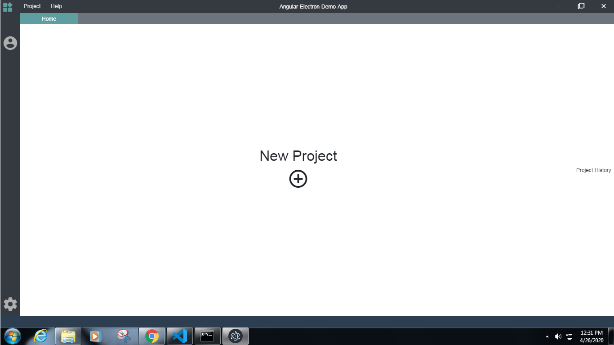

    

        <h1>Electron Angular Template<h1>
        
        <!-- <h6>Title not decided till now<h6> -->
    
 

# Electron Angular Template

---------------------------------------
 

---------------------------------------

---------------------------------------

#### Credits 

This repositoty is created with the help of [Angular Electron maximegris ](https://github.com/maximegris/angular-electron). Big Thanks for the boilerplate code.

----------------------------------------

#### Big reminder 

`ng serve` is not going to work as the browser mode dont support the netaive Library. Kindly use ` npm run ng:server` , which inerternally use `ng serve -c dev -o`

----------------------------------------

|Command|Description| 
|--|--|
|`npm run ng:serve`| Execute the app in the browser |
|`npm run backend:transpile`| Build the electron part of app in the /build folder. |
|`npm run frontend:transpile`| Build the angular Fe app with Angular aot. Your built files are in the /build/UT folder. |
|`npm run app:transpile`| Builds the complete application |
|`npm run electron:serve`| Execute the app in the electron  |
|`npm run app:transpile`| Builds the complete application |
|`npm run build:linux`| Execute the app in the electron for linux |
|`npm run build:windows`| Builds the complete application for Windows |
|`npm run build:mac`| Execute the app in the electron for MAC  |

## Features
1.  Title bar 
2.  Menubar
3.  Status bar 
4.  Tab bar

## Service 
1. Dialog Service
2. Tab Scheduleing service

https://scotch.io/tutorials/customize-the-browsers-scrollbar-with-css